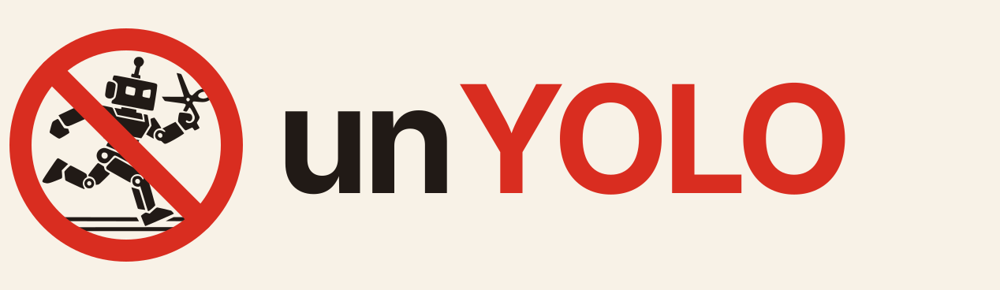

<p align="center">
  
</p>

# BrokerKit

BrokerKit is a Go toolkit and monorepo of brokered access-control services.
It keeps protected credentials and Unix privilege boundaries inside dedicated
broker processes, so untrusted clients such as coding agents receive only a
narrowly scoped, revocable broker credential instead of the real one.

The repository ships three separate broker executables, one UI plugin, and the
shared protocol they speak:

- [hf-broker](brokers/huggingface/README.md) brokers Hugging Face credentials
  for Git, LFS, Hub, and inference operations.
- [gh-broker](brokers/github/README.md) brokers GitHub App credentials for
  repository reads, Git operations, pull requests, and the wider GitHub API.
- [sudo-broker](brokers/sudo/README.md) runs approved exact commands as
  another Unix user through a root helper.
- [openclaw-brokerkit](plugins/openclaw/README.md) adds a provider-neutral
  approvals tab and `/brokerkit` commands to OpenClaw.
- [protocol](protocol/README.md) holds the canonical Operator V1 and
  Agent V1 wire artifacts and MCP operation documents shared by all of the
  above.

Each broker is a separate process with its own listener, credential domain,
state directory, release artifact, and audit stream. Install and operate them
independently; every broker README covers its own install, setup, and
day-to-day workflows.

## How a broker works

Every broker handles a request the same way:

```text
client request
        ↓
authenticate broker client
        ↓
classify request into client + operation + target + attrs
        ↓
policy decision: deny / active grant / allow / request / no_match
        ↓
optional operator approval grant
        ↓
provider-specific executor
        ↓
audit log
```

Policy lives in a manually edited rules file (`scope.json` or
`policy.json`) that the broker loads at startup. Requests the policy engine
cannot classify are refused: brokers fail closed. Dangerous operations can be
marked `request`, which parks them until an operator approves a short-lived
grant through the protected operator inbox or an optional Telegram
notification.

When Telegram is enabled, one host-level `brokerkit-telegram` process owns
inbound updates for the shared bot and dispatches decisions to provider
Operator V1 sockets. Provider brokers only send messages and durable status
updates. See [Telegram approval ingress](docs/TELEGRAM_INGRESS.md).

## Security model

- Secret material is write-only inside a broker. No API, log line, error, or
  helper returns the upstream credential, and audit logs never contain
  secrets, request bodies, or pack contents.
- Agent and operator credentials are separate. The operator inbox runs on its
  own listener with its own secret file; agent credentials cannot approve
  requests.
- Network reachability is not authorization. Every endpoint except
  `GET /healthz` requires authentication.
- Run a broker where its clients cannot inspect its process or credential
  files. Each broker ships a `doctor` command that verifies this isolation
  and fails closed.

The full boundary and fail-closed behavior are in
[docs/security/THREAT_MODEL.md](docs/security/THREAT_MODEL.md). The shared
install, setup, policy, grant, approval, audit, and doctor contract that all
brokers follow is in
[docs/UNIFIED_BROKER_CONTRACT.md](docs/UNIFIED_BROKER_CONTRACT.md).

## Building from source

The monorepo is one Go module. Build any broker with the Go version declared
in [go.mod](go.mod):

```sh
go build ./brokers/huggingface/cmd/hf-broker
go build ./brokers/github/cmd/gh-broker
go build ./brokers/sudo/cmd/sudo-broker ./brokers/sudo/cmd/sudo-broker-exec
```

For release installs, use each broker's `install.sh` bootstrap as described in
its README.

## License

[MIT](LICENSE)
